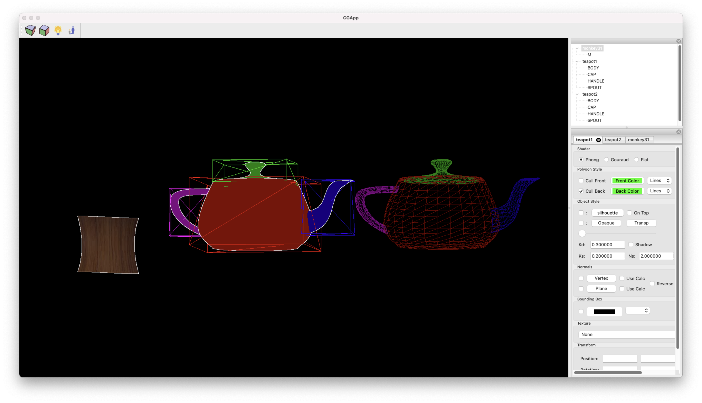
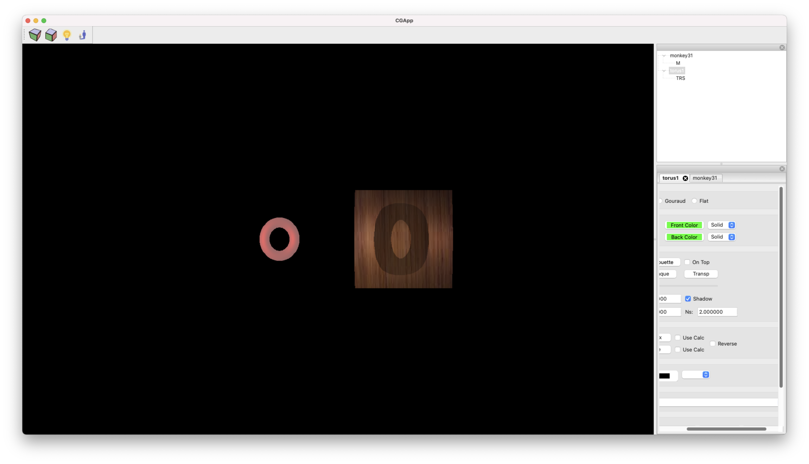

# GraphicsEngine
Very basic graphics engine that made as part of study 'Computer Graphics 1' at the Technion.


# Implementation

I decide to use [wxWidget](https://www.wxwidgets.org) as the base for this app.

All 3D rendering & Control flow are implemented by me and wxWidget use only to interact with the user.

As requirement from the course staff we needed to use [Irit](https://gershon.cs.technion.ac.il/irit/) library.

### Features:
* Up to 10 Lights source.
* Textures.
* Irit 3D models loading, Models can be found [here](https://gershon.cs.technion.ac.il/irit/data/).
* Phong, Gouraud and Flat shaders.
* Face culling & Polygon style for each face (Solid, Line or Points).
* Object Silhouette.
* Object bounding box.
* Shadows, Map shadow work bit Volume shadow is buggy.

---

# Build & Run
The app tested on Mac & Linux, It's run on windows but not tested.

### Requirements
* [wxWidget](https://www.wxwidgets.org/downloads/)
* make
* g++ (17 or higher)

### Build

Run ``` make all ``` inside the main folder.

### Run

Run ```./main``` inside the main folder.


---

# Screenshots


